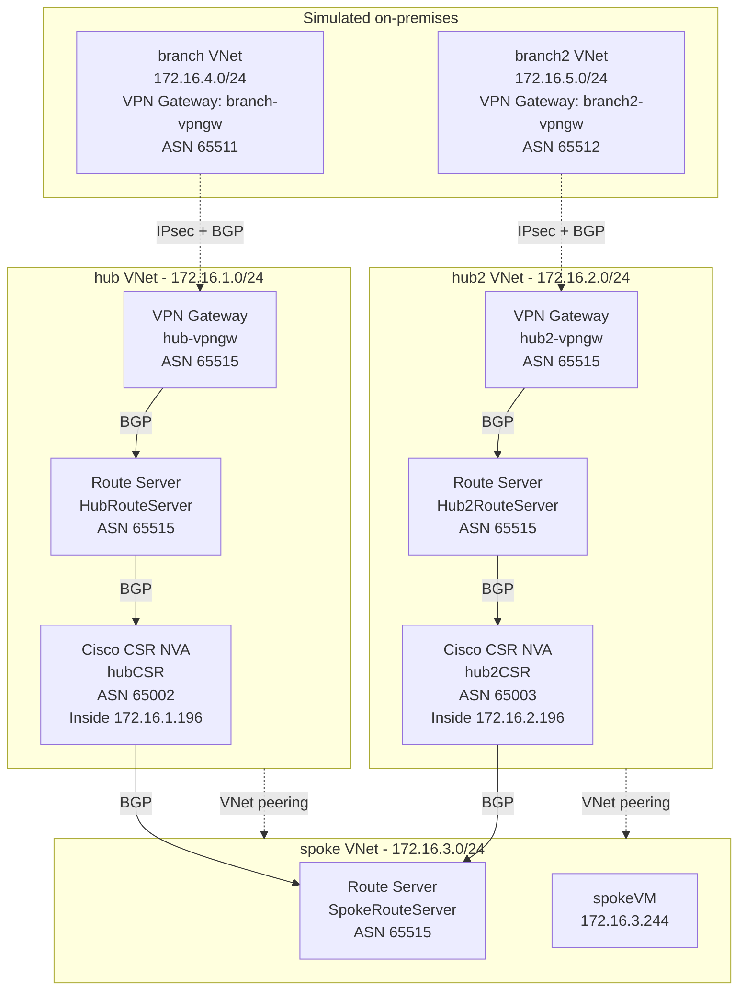

# Azure Route Server Dual-Home Lab


Deploy Azure Route Server (ARS) in a dual-homed topology with two hubs, Cisco CSR NVAs, redundant spoke reachability, and simulated on-premises connectivity using VNet-to-VNet IPsec with BGP.

> This lab follows the Microsoft dual-homed Route Server pattern and preserves the original command walkthrough below.

## Table of Contents

- [🎯 Lab Objectives](#-lab-objectives)
- [🗺️ Topology](#️-topology)
- [📋 Prerequisites](#-prerequisites)
- [⚙️ Parameters](#️-parameters)
- [🚀 Quick Start](#-quick-start)
- [📜 Step-by-step commands](#-step-by-step-commands)
- [✅ Validation](#-validation)
- [🧹 Cleanup](#-cleanup)
- [💡 Key Takeaways](#-key-takeaways)
- [📚 References](#-references)
- [📄 License](#-license)
- [Original README content](#original-readme-content-preserved-verbatim)

## 🎯 Lab Objectives

This lab demonstrates Azure Route Server dual-homed redundancy as an alternative to a single VNet-peering hub-and-spoke design. Spokes are peered to both hubs so that, if either hub or its ARS/NVA path fails, the other hub can continue serving routes for the spoke.

You will build:

- Two hub VNets: `hub` and `hub2`.
- One spoke VNet: `spoke`, peered to both hubs.
- Two simulated on-premises VNets: `branch` and `branch2`.
- Azure Route Server in each hub and in the spoke.
- Cisco CSR NVAs using ASNs `65002` and `65003`.
- VNet-to-VNet IPsec connections with BGP to simulate on-premises reachability.

## 🗺️ Topology




## 📋 Prerequisites

- Azure subscription with permission to create VNets, VPN gateways, Azure Route Server, public IPs, NICs, and VMs.
- Azure CLI installed and authenticated with `az login`.
- Bash shell (Git Bash, WSL, Azure Cloud Shell, or macOS/Linux shell).
- Cisco CSR 1000V Marketplace terms accepted, or let `scripts/deploy.sh` run the accept command.
- Budget awareness: expect roughly **$30-50/day** while running because this lab deploys multiple VPN gateways, Azure Route Server instances, public IPs, and VMs.

## ⚙️ Parameters

| Parameter | Default | Description |
|---|---:|---|
| `LOCATION` / `loc` | `EastUS2` | Azure region. |
| `RESOURCE_GROUP` / `rg` | `Lab_ARSDual` | Lab resource group. |
| `ADMIN_USERNAME` / `username` | `azureuser` | VM and CSR administrator username. |
| `ADMIN_PASSWORD` / `password` | `MyP@SSword123!` | Lab password from the original walkthrough. Change for real use. |
| `VM_SIZE` / `vmsize` | `Standard_D2_v2` | VM size for Ubuntu VMs and Cisco CSR NVAs. |
| Hub ASN | `65515` | Required gateway/Route Server ASN in this lab. |
| Branch ASNs | `65511`, `65512` | Simulated on-premises VPN gateway ASNs. |
| CSR ASNs | `65002`, `65003` | Cisco CSR NVA ASNs. |

## 🚀 Quick Start

```bash
az login
export RESOURCE_GROUP=Lab_ARSDual
export LOCATION=EastUS2
./scripts/deploy.sh
```

After Azure resources are deployed, paste the IOS configuration from [`scripts/csr-config.txt`](scripts/csr-config.txt) into the appropriate Cisco CSR serial consoles.

## 📜 Step-by-step commands

<details>
<summary>Parameters</summary>

```bash
#Paramaters
loc=EastUS2
rg=Lab_ARSDual
username=azureuser
password="MyP@SSword123!"
vmsize=Standard_D2_v2
```
</details>

<details>
<summary>Phase 1 - VNet and subnet setup</summary>

```bash
#Create the VNETs (Hubs+Spoke) and VPN Branches

az network vnet create --address-prefixes 172.16.1.0/24 -n hub -g $rg -l $loc --output none
az network vnet subnet create --name RouteServerSubnet --address-prefixes 172.16.1.0/25 --resource-group $rg --vnet-name hub --output none
az network vnet subnet create --name csroutside --address-prefixes 172.16.1.128/26 --resource-group $rg --vnet-name hub --output none
az network vnet subnet create --name csrinside --address-prefixes 172.16.1.192/27 --resource-group $rg --vnet-name hub --output none
az network vnet subnet create --name GatewaySubnet --address-prefixes 172.16.1.224/28 --resource-group $rg --vnet-name hub --output none
az network vnet subnet create --name vmsubnet --address-prefixes 172.16.1.240/29 --resource-group $rg --vnet-name hub --output none

az network vnet create --address-prefixes 172.16.2.0/24 -n hub2 -g $rg -l $loc --output none
az network vnet subnet create --name RouteServerSubnet --address-prefixes 172.16.2.0/25 --resource-group $rg --vnet-name hub2 --output none
az network vnet subnet create --name csroutside --address-prefixes 172.16.2.128/26 --resource-group $rg --vnet-name hub2 --output none
az network vnet subnet create --name csrinside --address-prefixes 172.16.2.192/27 --resource-group $rg --vnet-name hub2 --output none
az network vnet subnet create --name GatewaySubnet --address-prefixes 172.16.2.224/28 --resource-group $rg --vnet-name hub2 --output none
az network vnet subnet create --name vmsubnet --address-prefixes 172.16.2.240/29 --resource-group $rg --vnet-name hub --output none

az network vnet create --address-prefixes 172.16.3.0/24 -n spoke -g $rg -l $loc --output none 
az network vnet subnet create --name RouteServerSubnet --address-prefixes 172.16.3.0/25 --resource-group $rg --vnet-name spoke --output none
az network vnet subnet create --name vmsubnet --address-prefixes 172.16.3.240/29 --resource-group $rg --vnet-name spoke --output none

az network vnet create --address-prefixes 172.16.4.0/24 -n branch -g $rg -l $loc --output none
az network vnet subnet create --name vmsubnet --address-prefixes 172.16.4.0/25 --resource-group $rg --vnet-name branch --output none
az network vnet subnet create --name GatewaySubnet --address-prefixes 172.16.4.224/28 --resource-group $rg --vnet-name branch --output none

az network vnet create --address-prefixes 172.16.5.0/24 -n branch2 -g $rg -l $loc --output none 
az network vnet subnet create --name vmsubnet --address-prefixes 172.16.5.0/25 --resource-group $rg --vnet-name branch2 --output none
az network vnet subnet create --name GatewaySubnet --address-prefixes 172.16.5.224/28 --resource-group $rg --vnet-name branch2 --output none
```
</details>

<details>
<summary>Phase 2 - Spoke-to-hub VNet peering</summary>

```bash
#Create the peering between spoke and hub vnets

az network vnet peering create -g $rg -n HubtoSpoke --vnet-name hub --remote-vnet spoke --allow-vnet-access --allow-forwarded-traffic --output none
az network vnet peering create -g $rg -n SpoketoHub --vnet-name spoke --remote-vnet hub --allow-vnet-access --allow-forwarded-traffic --output none
az network vnet peering create -g $rg -n Hub2toSpoke --vnet-name hub2 --remote-vnet spoke --allow-vnet-access --allow-forwarded-traffic --output none
az network vnet peering create -g $rg -n SpoketoHub2 --vnet-name spoke --remote-vnet hub2 --allow-vnet-access --allow-forwarded-traffic --output none
```
</details>

<details>
<summary>Phase 3 - Hub NVAs (Cisco CSR)</summary>

```bash
#Create the NVAs (CSR) in each hub

az vm image terms accept --urn cisco:cisco-csr-1000v:17_3_4a-byol:latest --output none

az network public-ip create --name CSRPubIP --resource-group $rg --idle-timeout 30 --allocation-method Static --location $loc --output none
az network nic create --name CSROutsideInt -g $rg --subnet csroutside --vnet hub --public-ip-address CSRPubIP --ip-forwarding true --location $loc --output none
az network nic create --name CSRInsideInt -g $rg --subnet csrinside --vnet hub --ip-forwarding true --location $loc --output none
az vm create --resource-group $rg --location $loc --name hubCSR --size $vmsize --nics CSROutsideInterface CSRInsideInterface --image cisco:cisco-csr-1000v:17_3_4a-byol:latest --admin-username azureuser --admin-password MyP@SSword123!

az network public-ip create --name CSRPubIP2 --resource-group $rg --idle-timeout 30 --allocation-method Static --location $loc --output none
az network nic create --name CSROutsideInt2 -g $rg --subnet csroutside --vnet hub2 --public-ip-address CSRPubIP2 --ip-forwarding true --location $loc --output none
az network nic create --name CSRInsideInt2 -g $rg --subnet csrinside --vnet hub2 --ip-forwarding true --location $loc --output none
az vm create --resource-group $rg --location $loc --name hub2CSR --size $vmsize --nics CSROutsideInt2 CSRInsideInt2 --image cisco:cisco-csr-1000v:17_3_4a-byol:latest --admin-username azureuser --admin-password MyP@SSword123!
```
</details>

<details>
<summary>Phase 4 - Hub VPN gateways</summary>

```bash
#Create the GWs for the hub VNETs

(ARS requires A/A GWs and hub GW ASN must be 65515) 
az network public-ip create -n hub-vpngw-pip -g $rg --location $loc --sku Basic --output none
az network public-ip create -n hub-vpngwPIP -g $rg --location $loc --sku Basic --output none
az network public-ip create -n hub2-vpngw-pip -g $rg --location $loc --sku Basic --output none
az network public-ip create -n hub2-vpngwPIP -g $rg --location $loc --sku Basic --output none

az network vnet-gateway create -n hub-vpngw --public-ip-addresses hub-vpngw-pip hub-vpngwPIP -g $rg --vnet hub --asn 65515 --gateway-type Vpn -l $loc --sku VpnGw1 --vpn-gateway-generation Generation1 --no-wait 
az network vnet-gateway create -n hub2-vpngw --public-ip-addresses hub2-vpngw-pip hub2-vpngwPIP -g $rg --vnet hub2 --asn 65515 --gateway-type Vpn -l $loc --sku VpnGw1 --vpn-gateway-generation Generation1 --no-wait
```
</details>

<details>
<summary>Phase 5 - Simulated on-premises branch gateways</summary>

```bash
#Create the GWs for the branch VNETS

az network public-ip create -n branch-vpngw-pip -g $rg --location $loc --sku Basic --output none
az network public-ip create -n branch-vpngwPIP -g $rg --location $loc --sku Basic --output none
az network public-ip create -n branch2-vpngw-pip -g $rg --location $loc --sku Basic --output none
az network public-ip create -n branch2-vpngwPIP -g $rg --location $loc --sku Basic --output none

az network vnet-gateway create -n branch-vpngw --public-ip-addresses branch-vpngw-pip branch-vpngwPIP -g $rg --vnet branch --asn 65511 --gateway-type Vpn -l $loc --sku VpnGw1 --vpn-gateway-generation Generation1 --no-wait 
az network vnet-gateway create -n branch2-vpngw --public-ip-addresses branch2-vpngw-pip branch2-vpngwPIP -g $rg --vnet branch2 --asn 65512 --gateway-type Vpn -l $loc --sku VpnGw1 --vpn-gateway-generation Generation1 --no-wait

#Get Pips and BGP Settings

hubbgp=$(az network vnet-gateway show -n hub-vpngw -g $rg --query 'bgpSettings.bgpPeeringAddresses[0].defaultBgpIpAddresses[0]' -o tsv)
hubpip=$(az network vnet-gateway show -n hub-vpngw -g $rg --query 'bgpSettings.bgpPeeringAddresses[0].tunnelIpAddresses[0]' -o tsv)
hub2bgp=$(az network vpn-gateway show -n hub2-vpngw -g $rg --query 'bgpSettings.bgpPeeringAddresses[0].defaultBgpIpAddresses[0]' -o tsv)
hub2pip=$(az network vpn-gateway show -n hub2-vpngw -g $rg --query 'bgpSettings.bgpPeeringAddresses[0].tunnelIpAddresses[0]' -o tsv)

branchbgp=$(az network vpn-gateway show -n branch-vpngw -g $rg --query 'bgpSettings.bgpPeeringAddresses[0].defaultBgpIpAddresses[0]' -o tsv)
branchpip=$(az network vnet-gateway show -n branch-vpngw -g $rg --query 'bgpSettings.bgpPeeringAddresses[0].tunnelIpAddresses[0]' -o tsv)
branch2bgp=$(az network vpn-gateway show -n branch2-vpngw -g $rg --query 'bgpSettings.bgpPeeringAddresses[0].defaultBgpIpAddresses[0]' -o tsv)
branch2pip=$(az network vpn-gateway show -n branch2-vpngw -g $rg --query 'bgpSettings.bgpPeeringAddresses[0].tunnelIpAddresses[0]' -o tsv)
```
</details>

<details>
<summary>Phase 6 - BGP/IPsec VNet-to-VNet connections</summary>

```bash
#Create Connection objects (Have to do V2V since you cannot specify 65515 for both LNG and VPNGW for S2S with ARS)

az network vpn-connection create -n hubtobranch -g $rg -l $loc --vnet-gateway1 hub-vpngw --vnet-gateway2 branch-vpngw --enable-bgp --shared-key 'abc123' --output none
az network vpn-connection create -n branchtohub -g $rg -l $loc --vnet-gateway1 branch-vpngw --vnet-gateway2 hub-vpngw --enable-bgp --shared-key 'abc123' --output none
az network vpn-connection create -n hub2tobranch2 -g $rg -l $loc --vnet-gateway1 hub2-vpngw --vnet-gateway2 branch2-vpngw --enable-bgp --shared-key 'abc123' --output none
az network vpn-connection create -n branch2tohub2 -g $rg -l $loc --vnet-gateway1 branch2-vpngw --vnet-gateway2 hub2-vpngw --enable-bgp --shared-key 'abc123' --output none
```
</details>

<details>
<summary>Phase 7 - Azure Route Server and ARS-to-CSR peerings</summary>

```bash
#Create the ARS in hubs and spoke

#Create the Pips
az network public-ip create --name HubRouteServerIP --resource-group $rg  --version IPv4 --sku Standard --output none
az network public-ip create --name Hub2RouteServerIP --resource-group $rg  --version IPv4 --sku Standard --output none
az network public-ip create --name SpokeRouteServerIP --resource-group $rg  --version IPv4 --sku Standard --output none

#Get the ARS SubnetIds
arshubsubnet_id=$(az network vnet subnet show --name RouteServerSubnet --resource-group $rg --vnet-name hub --query id -o tsv)
echo @arshubsubnet_id

arshub2subnet_id=$(az network vnet subnet show --name RouteServerSubnet --resource-group $rg --vnet-name hub2 --query id -o tsv)
echo @routeserverhubsubnet_id

arsspokesubnet_id=$(az network vnet subnet show --name RouteServerSubnet --resource-group $rg --vnet-name spoke --query id -o tsv)
echo @routeserverhubsubnet_id

az network routeserver create --name HubRouteServer --resource-group $rg --hosted-subnet $arshubsubnet_id --public-ip-address HubRouteServerIP --output none
az network routeserver create --name Hub2RouteServer --resource-group $rg --hosted-subnet $arshub2subnet_id --public-ip-address Hub2RouteServerIP --output none
az network routeserver create --name SpokeRouteServer --resource-group $rg --hosted-subnet $arsspokesubnet_id --public-ip-address SpokeRouteServerIP   --output none

#Create the BGP connection between ARS and CSRs
#We will use CSR ASNs of 65002, 65003

az network routeserver peering create --name hubCSR --peer-ip 172.16.1.196 --peer-asn 65002 --routeserver HubRouteServer --resource-group $rg --output none
az network routeserver peering create --name hub2CSR --peer-ip 172.16.2.196 --peer-asn 65003 --routeserver Hub2RouteServer --resource-group $rg --output none
az network routeserver peering create --name hubCSR --peer-ip 172.16.1.196 --peer-asn 65002 --routeserver SpokeRouteServer --resource-group $rg --output none
az network routeserver peering create --name hub2CSR --peer-ip 172.16.2.196 --peer-asn 65003 --routeserver SpokeRouteServer --resource-group $rg --output none
```
</details>

<details>
<summary>Phase 8 - Cisco CSR BGP configuration</summary>

```text
#Create the CSR BGP Config to peer with ARS
#Get ARS IPs need for CSR Config

az network routeserver show --name HubRouteServer --resource-group $rg
az network routeserver show --name Hub2RouteServer --resource-group $rg
az network routeserver show --name SpokeRouteServer --resource-group $rg

# In Serial console type enable<hit enter>, conf-t
router bgp 65002 <--HubCSR
neighbor 172.16.1.5 remote-as 65515
neighbor 172.16.1.5 ebgp-multihop 255
neighbor 172.16.1.4 remote-as 65515
neighbor 172.16.1.4 ebgp-multihop 255
neighbor 172.16.3.5 remote-as 65515
neighbor 172.16.3.5 ebgp-multihop 255
neighbor 172.16.3.4 remote-as 65515
neighbor 172.16.3.4 ebgp-multihop 255
	 !
address-family ipv4
neighbor 172.16.1.5 activate
neighbor 172.16.1.4 activate
neighbor 172.16.3.5 activate
neighbor 172.16.3.4 activate
exit-address-family
	!
router bgp 65002
address-family ipv4
neighbor 172.16.3.4 as-override
neighbor 172.16.3.5 as-override
exit-address-family
 
address-family ipv4
neighbor 172.16.1.4 as-override
neighbor 172.16.1.5 as-override
exit-address-family

add static route to ARS subnet that point to the default gateway of the CSR Internal subnet to avoid recursive routing failure for ARS BGP endpoints learned via BGP
ip route 172.16.1.0 255.255.255.0 172.16.1.193
ip route 172.16.3.0 255.255.255.0 172.16.1.193

az network routeserver peering list-learned-routes --name hubcsr --routeserver HubRouteServer --resource-group $rg

router bgp 65003 <--Hub2CSR
neighbor 172.16.2.5 remote-as 65515
neighbor 172.16.2.5 ebgp-multihop 255
neighbor 172.16.2.4 remote-as 65515
neighbor 172.16.2.4 ebgp-multihop 255
neighbor 172.16.3.5 remote-as 65515
neighbor 172.16.3.5 ebgp-multihop 255
neighbor 172.16.3.4 remote-as 65515
neighbor 172.16.3.4 ebgp-multihop 255
	 !
address-family ipv4
neighbor 172.16.2.5 activate
neighbor 172.16.2.4 activate
neighbor 172.16.3.5 activate
neighbor 172.16.3.4 activate
exit-address-family
	!
router bgp 65003
address-family ipv4
neighbor 172.16.3.4 as-override
neighbor 172.16.3.5 as-override
exit-address-family
 
address-family ipv4
neighbor 172.16.2.4 as-override
neighbor 172.16.2.5 as-override
exit-address-family

add static route to ARS subnet that point to the default gateway of the CSR2 Internal subnet to avoid recursive routing failure for ARS BGP endpoints learned via BGP
ip route 172.16.2.0 255.255.255.0 172.16.2.193
```
</details>

<details>
<summary>Phase 9 - Test VMs</summary>

```bash
#Create the IaaS VMs in branchs, hubs and spoke to test the connection and learned routes

az vm create -n hubVM  -g $rg --image ubuntults --public-ip-sku Standard --size $vmsize -l $loc --subnet vmsubnet --vnet-name hub --admin-username $username --admin-password $password --no-wait
az vm create -n hub2VM  -g $rg --image ubuntults --public-ip-sku Standard --size $vmsize -l $loc --subnet vmsubnet --vnet-name hub2 --admin-username $username --admin-password $password --no-wait
az vm create -n spokeVM  -g $rg --image ubuntults --public-ip-sku Standard --size $vmsize -l $loc --subnet vmsubnet --vnet-name spoke --admin-username $username --admin-password $password --no-wait
az vm create -n branchVM  -g $rg --image ubuntults --public-ip-sku Standard --size $vmsize -l $loc --subnet vmsubnet --vnet-name branch --admin-username $username --admin-password $password --no-wait
az vm create -n branch2VM  -g $rg --image ubuntults --public-ip-sku Standard --size $vmsize -l $loc --subnet vmsubnet --vnet-name branch2 --admin-username $username --admin-password $password --no-wait
```
</details>

<details>
<summary>Original validation output and connectivity tests</summary>

```text
#Verify BGP on CSRs and ARS learned routes on CSRs

#HubCSR BGP State and Learned Routes

hubCSR#sh ip bgp summ
BGP router identifier 172.16.1.132, local AS number 65002
BGP table version is 4, main routing table version 4
3 network entries using 744 bytes of memory
6 path entries using 816 bytes of memory
2/2 BGP path/bestpath attribute entries using 576 bytes of memory
2 BGP AS-PATH entries using 64 bytes of memory
0 BGP route-map cache entries using 0 bytes of memory
0 BGP filter-list cache entries using 0 bytes of memory
BGP using 2200 total bytes of memory
BGP activity 3/0 prefixes, 6/0 paths, scan interval 60 secs
3 networks peaked at 22:21:30 Feb 3 2023 UTC (00:16:08.210 ago)

Neighbor        V           AS MsgRcvd MsgSent   TblVer  InQ OutQ Up/Down  State/PfxRcd
172.16.1.4      4        65515      22      22        4    0    0 00:16:04        2
172.16.1.5      4        65515      22      22        4    0    0 00:16:07        2
172.16.3.4      4        65515      21      22        4    0    0 00:16:08        1
172.16.3.5      4        65515      21      22        4    0    0 00:16:06        1

hubCSR#sh ip route
Codes: L - local, C - connected, S - static, R - RIP, M - mobile, B - BGP
       D - EIGRP, EX - EIGRP external, O - OSPF, IA - OSPF inter area 
       N1 - OSPF NSSA external type 1, N2 - OSPF NSSA external type 2
       E1 - OSPF external type 1, E2 - OSPF external type 2, m - OMP
       n - NAT, Ni - NAT inside, No - NAT outside, Nd - NAT DIA
       i - IS-IS, su - IS-IS summary, L1 - IS-IS level-1, L2 - IS-IS level-2
       ia - IS-IS inter area, * - candidate default, U - per-user static route
       H - NHRP, G - NHRP registered, g - NHRP registration summary
       o - ODR, P - periodic downloaded static route, l - LISP
       a - application route
       + - replicated route, % - next hop override, p - overrides from PfR
       & - replicated local route overrides by connected

Gateway of last resort is 172.16.1.129 to network 0.0.0.0

S*    0.0.0.0/0 [1/0] via 172.16.1.129
      168.63.0.0/32 is subnetted, 1 subnets
S        168.63.129.16 [254/0] via 172.16.1.129
      169.254.0.0/32 is subnetted, 1 subnets
S        169.254.169.254 [254/0] via 172.16.1.129
      172.16.0.0/16 is variably subnetted, 7 subnets, 4 masks
S        172.16.1.0/24 [1/0] via 172.16.1.193
C        172.16.1.128/26 is directly connected, GigabitEthernet1
L        172.16.1.132/32 is directly connected, GigabitEthernet1
C        172.16.1.192/27 is directly connected, GigabitEthernet2
L        172.16.1.196/32 is directly connected, GigabitEthernet2
S        172.16.3.0/24 [1/0] via 172.16.1.1
B        172.16.4.0/24 [20/0] via 172.16.1.4, 00:16:26
hubCSR#
hubCSR#sh ip bgp
BGP table version is 4, local router ID is 172.16.1.132
Status codes: s suppressed, d damped, h history, * valid, > best, i - internal, 
              r RIB-failure, S Stale, m multipath, b backup-path, f RT-Filter, 
              x best-external, a additional-path, c RIB-compressed, 
              t secondary path, L long-lived-stale,
Origin codes: i - IGP, e - EGP, ? - incomplete
RPKI validation codes: V valid, I invalid, N Not found

     Network          Next Hop            Metric LocPrf Weight Path
 r>   172.16.1.0/24    172.16.1.4                             0 65515 i
 r                     172.16.1.5                             0 65515 i
 r    172.16.3.0/24    172.16.3.5                             0 65515 i
 r>                    172.16.3.4                             0 65515 i
 *>   172.16.4.0/24    172.16.1.4                             0 65515 65512 i
 *                     172.16.1.5                             0 65515 65512 i

#Hub2CSR BGP State and Learned Routes

hub2CSR#sh ip bgp summ
BGP router identifier 172.16.2.196, local AS number 65003
BGP table version is 4, main routing table version 4
3 network entries using 744 bytes of memory
6 path entries using 816 bytes of memory
2/2 BGP path/bestpath attribute entries using 576 bytes of memory
2 BGP AS-PATH entries using 64 bytes of memory
0 BGP route-map cache entries using 0 bytes of memory
0 BGP filter-list cache entries using 0 bytes of memory
BGP using 2200 total bytes of memory
BGP activity 3/0 prefixes, 6/0 paths, scan interval 60 secs
3 networks peaked at 22:21:16 Feb 3 2023 UTC (00:25:56.682 ago)

Neighbor        V           AS MsgRcvd MsgSent   TblVer  InQ OutQ Up/Down  State/PfxRcd
172.16.2.4      4        65515      33      33        4    0    0 00:25:56        2
172.16.2.5      4        65515      33      33        4    0    0 00:25:55        2
172.16.3.4      4        65515      32      33        4    0    0 00:25:58        1
172.16.3.5      4        65515      32      34        4    0    0 00:25:57        1

hub2CSR#sh ip bgp
BGP table version is 4, local router ID is 172.16.2.196
Status codes: s suppressed, d damped, h history, * valid, > best, i - internal, 
              r RIB-failure, S Stale, m multipath, b backup-path, f RT-Filter, 
              x best-external, a additional-path, c RIB-compressed, 
              t secondary path, L long-lived-stale,
Origin codes: i - IGP, e - EGP, ? - incomplete
RPKI validation codes: V valid, I invalid, N Not found

     Network          Next Hop            Metric LocPrf Weight Path
 r    172.16.2.0/24    172.16.2.5                             0 65515 i
 r>                    172.16.2.4                             0 65515 i
 r    172.16.3.0/24    172.16.3.5                             0 65515 i
 r>                    172.16.3.4                             0 65515 i
 *    172.16.5.0/24    172.16.2.5                             0 65515 65511 i
 *>                    172.16.2.4                             0 65515 65511 i
hub2CSR#sh ip route
Codes: L - local, C - connected, S - static, R - RIP, M - mobile, B - BGP
       D - EIGRP, EX - EIGRP external, O - OSPF, IA - OSPF inter area 
       N1 - OSPF NSSA external type 1, N2 - OSPF NSSA external type 2
       E1 - OSPF external type 1, E2 - OSPF external type 2, m - OMP
       n - NAT, Ni - NAT inside, No - NAT outside, Nd - NAT DIA
       i - IS-IS, su - IS-IS summary, L1 - IS-IS level-1, L2 - IS-IS level-2
       ia - IS-IS inter area, * - candidate default, U - per-user static route
       H - NHRP, G - NHRP registered, g - NHRP registration summary
       o - ODR, P - periodic downloaded static route, l - LISP
       a - application route
       + - replicated route, % - next hop override, p - overrides from PfR
       & - replicated local route overrides by connected

Gateway of last resort is 172.16.2.129 to network 0.0.0.0

S*    0.0.0.0/0 [1/0] via 172.16.2.129
      168.63.0.0/32 is subnetted, 1 subnets
S        168.63.129.16 [254/0] via 172.16.2.129
      169.254.0.0/32 is subnetted, 1 subnets
S        169.254.169.254 [254/0] via 172.16.2.129
      172.16.0.0/16 is variably subnetted, 7 subnets, 4 masks
S        172.16.2.0/24 [1/0] via 172.16.2.193
C        172.16.2.128/26 is directly connected, GigabitEthernet1
L        172.16.2.132/32 is directly connected, GigabitEthernet1
C        172.16.2.192/27 is directly connected, GigabitEthernet2
L        172.16.2.196/32 is directly connected, GigabitEthernet2
S        172.16.3.0/24 [1/0] via 172.16.2.193
B        172.16.5.0/24 [20/0] via 172.16.2.4, 00:25:26


#Testing connectivity across VMs
#BranchVM to HubVM and SpokeVM

azureuser@branchVM:~$ ping -c 5 172.16.1.244
PING 172.16.1.244 (172.16.1.244) 56(84) bytes of data.
64 bytes from 172.16.1.244: icmp_seq=1 ttl=64 time=10.2 ms
64 bytes from 172.16.1.244: icmp_seq=2 ttl=64 time=2.95 ms
64 bytes from 172.16.1.244: icmp_seq=3 ttl=64 time=3.16 ms
64 bytes from 172.16.1.244: icmp_seq=4 ttl=64 time=3.50 ms
64 bytes from 172.16.1.244: icmp_seq=5 ttl=64 time=3.28 ms

--- 172.16.1.244 ping statistics ---
5 packets transmitted, 5 received, 0% packet loss, time 4006ms
rtt min/avg/max/mdev = 2.953/4.637/10.281/2.828 ms
azureuser@branchVM:~$

azureuser@branchVM:~$ ping -c 5 172.16.3.244
PING 172.16.3.244 (172.16.3.244) 56(84) bytes of data.
64 bytes from 172.16.3.244: icmp_seq=1 ttl=63 time=4.88 ms
64 bytes from 172.16.3.244: icmp_seq=2 ttl=63 time=4.01 ms
64 bytes from 172.16.3.244: icmp_seq=3 ttl=63 time=3.17 ms
64 bytes from 172.16.3.244: icmp_seq=4 ttl=63 time=3.88 ms
64 bytes from 172.16.3.244: icmp_seq=5 ttl=63 time=4.68 ms

--- 172.16.3.244 ping statistics ---
5 packets transmitted, 5 received, 0% packet loss, time 4006ms
rtt min/avg/max/mdev = 3.173/4.129/4.888/0.616 ms
azureuser@branchVM:~$

#Branch2VM to Hub2VM and SpokeVM

azureuser@branch2VM:~$ ping 172.16.2.244 -c 5
PING 172.16.2.244 (172.16.2.244) 56(84) bytes of data.
64 bytes from 172.16.2.244: icmp_seq=1 ttl=64 time=4.24 ms
64 bytes from 172.16.2.244: icmp_seq=2 ttl=64 time=6.31 ms
64 bytes from 172.16.2.244: icmp_seq=3 ttl=64 time=12.2 ms
64 bytes from 172.16.2.244: icmp_seq=4 ttl=64 time=9.63 ms
64 bytes from 172.16.2.244: icmp_seq=5 ttl=64 time=3.61 ms

--- 172.16.2.244 ping statistics ---
5 packets transmitted, 5 received, 0% packet loss, time 4006ms
rtt min/avg/max/mdev = 3.610/7.208/12.239/3.279 ms
azureuser@branch2VM:~$

azureuser@branch2VM:~$ ping 172.16.3.244 -c 5
PING 172.16.3.244 (172.16.3.244) 56(84) bytes of data.
64 bytes from 172.16.3.244: icmp_seq=1 ttl=63 time=24.5 ms
64 bytes from 172.16.3.244: icmp_seq=2 ttl=63 time=14.0 ms
64 bytes from 172.16.3.244: icmp_seq=3 ttl=63 time=3.41 ms
64 bytes from 172.16.3.244: icmp_seq=4 ttl=63 time=5.08 ms
64 bytes from 172.16.3.244: icmp_seq=5 ttl=63 time=3.64 ms

--- 172.16.3.244 ping statistics ---
5 packets transmitted, 5 received, 0% packet loss, time 4004ms
rtt min/avg/max/mdev = 3.416/10.159/24.565/8.203 ms
azureuser@branch2VM:~$
```
</details>

## ✅ Validation

Run the read-only validation helper after deployment and CSR configuration:

```bash
./scripts/verify.sh
```

The script checks:

- Learned routes on `HubRouteServer` and `Hub2RouteServer` with `az network routeserver peering list-learned-routes`.
- Azure-side Route Server BGP peering state for both NVAs.
- IPsec/VNet-to-VNet tunnel connection state for hub-to-branch connections.
- Effective routes for the spoke VM NIC.

## 🧹 Cleanup

```bash
./scripts/cleanup.sh
```

The cleanup helper prompts before deleting the `Lab_ARSDual` resource group.

## 💡 Key Takeaways

- Dual-homing improves resiliency over a single-hub design because the spoke learns routes from both hubs.
- Use this pattern when hub failure isolation, side-car connectivity, or redundant network virtual appliance paths are required.
- VNet-to-VNet IPsec with BGP is used here to simulate on-premises because the Azure VPN gateway and local network gateway path cannot reuse ASN `65515` for two real S2S tunnels in this ARS scenario.
- This is a lab topology; review cost, security, and operational controls before adapting it for production.

## 📚 References

- [Azure Route Server dual-homed network](https://learn.microsoft.com/en-us/azure/route-server/about-dual-homed-network)
- [Azure Route Server documentation](https://learn.microsoft.com/en-us/azure/route-server/)
- [Azure Route Server FAQ](https://learn.microsoft.com/en-us/azure/route-server/route-server-faq)

## 📄 License

This project is licensed under the [MIT License](LICENSE).

## Original README content (preserved verbatim)

<details>
<summary>Click to expand the original README</summary>

````markdown
# Azure-Route-Server Dual Home
In this lab, we are going to deploy ARS in a dual home topology following this public article: https://learn.microsoft.com/en-us/azure/route-server/about-dual-homed-network. This is an alternative approach besides using VNET peering to connect resources in a hub+spoke model and allow connections to and from on-premise. This could be useful in a side car environment. If say one of the hubs went down with ARS (hub or hub2), the spoke would still be reachable via the other hub. In this lab, we are going to use Vnet-to-Vnet IPSEC connections with BGP simmulating on-premise instead of two ExpressRoute circuits. This is also needed, because you cannot do both VNG and LNG with the same ASN(65515), when building S2S IPSEC connections.

This lab is using serial console for all VM connections including the CSRs. The username is "azureser" and password is MyP@SSword123! for all machines. 

# Topology


## Commands
```bash
#Paramaters
loc=EastUS2
rg=Lab_ARSDual
username=azureuser
password="MyP@SSword123!"
vmsize=Standard_D2_v2

#Create the VNETs (Hubs+Spoke) and VPN Branches

az network vnet create --address-prefixes 172.16.1.0/24 -n hub -g $rg -l $loc --output none
az network vnet subnet create --name RouteServerSubnet --address-prefixes 172.16.1.0/25 --resource-group $rg --vnet-name hub --output none
az network vnet subnet create --name csroutside --address-prefixes 172.16.1.128/26 --resource-group $rg --vnet-name hub --output none
az network vnet subnet create --name csrinside --address-prefixes 172.16.1.192/27 --resource-group $rg --vnet-name hub --output none
az network vnet subnet create --name GatewaySubnet --address-prefixes 172.16.1.224/28 --resource-group $rg --vnet-name hub --output none
az network vnet subnet create --name vmsubnet --address-prefixes 172.16.1.240/29 --resource-group $rg --vnet-name hub --output none

az network vnet create --address-prefixes 172.16.2.0/24 -n hub2 -g $rg -l $loc --output none
az network vnet subnet create --name RouteServerSubnet --address-prefixes 172.16.2.0/25 --resource-group $rg --vnet-name hub2 --output none
az network vnet subnet create --name csroutside --address-prefixes 172.16.2.128/26 --resource-group $rg --vnet-name hub2 --output none
az network vnet subnet create --name csrinside --address-prefixes 172.16.2.192/27 --resource-group $rg --vnet-name hub2 --output none
az network vnet subnet create --name GatewaySubnet --address-prefixes 172.16.2.224/28 --resource-group $rg --vnet-name hub2 --output none
az network vnet subnet create --name vmsubnet --address-prefixes 172.16.2.240/29 --resource-group $rg --vnet-name hub --output none

az network vnet create --address-prefixes 172.16.3.0/24 -n spoke -g $rg -l $loc --output none 
az network vnet subnet create --name RouteServerSubnet --address-prefixes 172.16.3.0/25 --resource-group $rg --vnet-name spoke --output none
az network vnet subnet create --name vmsubnet --address-prefixes 172.16.3.240/29 --resource-group $rg --vnet-name spoke --output none

az network vnet create --address-prefixes 172.16.4.0/24 -n branch -g $rg -l $loc --output none
az network vnet subnet create --name vmsubnet --address-prefixes 172.16.4.0/25 --resource-group $rg --vnet-name branch --output none
az network vnet subnet create --name GatewaySubnet --address-prefixes 172.16.4.224/28 --resource-group $rg --vnet-name branch --output none

az network vnet create --address-prefixes 172.16.5.0/24 -n branch2 -g $rg -l $loc --output none 
az network vnet subnet create --name vmsubnet --address-prefixes 172.16.5.0/25 --resource-group $rg --vnet-name branch2 --output none
az network vnet subnet create --name GatewaySubnet --address-prefixes 172.16.5.224/28 --resource-group $rg --vnet-name branch2 --output none

#Create the peering between spoke and hub vnets

az network vnet peering create -g $rg -n HubtoSpoke --vnet-name hub --remote-vnet spoke --allow-vnet-access --allow-forwarded-traffic --output none
az network vnet peering create -g $rg -n SpoketoHub --vnet-name spoke --remote-vnet hub --allow-vnet-access --allow-forwarded-traffic --output none
az network vnet peering create -g $rg -n Hub2toSpoke --vnet-name hub2 --remote-vnet spoke --allow-vnet-access --allow-forwarded-traffic --output none
az network vnet peering create -g $rg -n SpoketoHub2 --vnet-name spoke --remote-vnet hub2 --allow-vnet-access --allow-forwarded-traffic --output none

#Create the NVAs (CSR) in each hub

az vm image terms accept --urn cisco:cisco-csr-1000v:17_3_4a-byol:latest --output none

az network public-ip create --name CSRPubIP --resource-group $rg --idle-timeout 30 --allocation-method Static --location $loc --output none
az network nic create --name CSROutsideInt -g $rg --subnet csroutside --vnet hub --public-ip-address CSRPubIP --ip-forwarding true --location $loc --output none
az network nic create --name CSRInsideInt -g $rg --subnet csrinside --vnet hub --ip-forwarding true --location $loc --output none
az vm create --resource-group $rg --location $loc --name hubCSR --size $vmsize --nics CSROutsideInterface CSRInsideInterface --image cisco:cisco-csr-1000v:17_3_4a-byol:latest --admin-username azureuser --admin-password MyP@SSword123!

az network public-ip create --name CSRPubIP2 --resource-group $rg --idle-timeout 30 --allocation-method Static --location $loc --output none
az network nic create --name CSROutsideInt2 -g $rg --subnet csroutside --vnet hub2 --public-ip-address CSRPubIP2 --ip-forwarding true --location $loc --output none
az network nic create --name CSRInsideInt2 -g $rg --subnet csrinside --vnet hub2 --ip-forwarding true --location $loc --output none
az vm create --resource-group $rg --location $loc --name hub2CSR --size $vmsize --nics CSROutsideInt2 CSRInsideInt2 --image cisco:cisco-csr-1000v:17_3_4a-byol:latest --admin-username azureuser --admin-password MyP@SSword123!

#Create the GWs for the hub VNETs

(ARS requires A/A GWs and hub GW ASN must be 65515) 
az network public-ip create -n hub-vpngw-pip -g $rg --location $loc --sku Basic --output none
az network public-ip create -n hub-vpngwPIP -g $rg --location $loc --sku Basic --output none
az network public-ip create -n hub2-vpngw-pip -g $rg --location $loc --sku Basic --output none
az network public-ip create -n hub2-vpngwPIP -g $rg --location $loc --sku Basic --output none

az network vnet-gateway create -n hub-vpngw --public-ip-addresses hub-vpngw-pip hub-vpngwPIP -g $rg --vnet hub --asn 65515 --gateway-type Vpn -l $loc --sku VpnGw1 --vpn-gateway-generation Generation1 --no-wait 
az network vnet-gateway create -n hub2-vpngw --public-ip-addresses hub2-vpngw-pip hub2-vpngwPIP -g $rg --vnet hub2 --asn 65515 --gateway-type Vpn -l $loc --sku VpnGw1 --vpn-gateway-generation Generation1 --no-wait

#Create the GWs for the branch VNETS

az network public-ip create -n branch-vpngw-pip -g $rg --location $loc --sku Basic --output none
az network public-ip create -n branch-vpngwPIP -g $rg --location $loc --sku Basic --output none
az network public-ip create -n branch2-vpngw-pip -g $rg --location $loc --sku Basic --output none
az network public-ip create -n branch2-vpngwPIP -g $rg --location $loc --sku Basic --output none

az network vnet-gateway create -n branch-vpngw --public-ip-addresses branch-vpngw-pip branch-vpngwPIP -g $rg --vnet branch --asn 65511 --gateway-type Vpn -l $loc --sku VpnGw1 --vpn-gateway-generation Generation1 --no-wait 
az network vnet-gateway create -n branch2-vpngw --public-ip-addresses branch2-vpngw-pip branch2-vpngwPIP -g $rg --vnet branch2 --asn 65512 --gateway-type Vpn -l $loc --sku VpnGw1 --vpn-gateway-generation Generation1 --no-wait

#Get Pips and BGP Settings

hubbgp=$(az network vnet-gateway show -n hub-vpngw -g $rg --query 'bgpSettings.bgpPeeringAddresses[0].defaultBgpIpAddresses[0]' -o tsv)
hubpip=$(az network vnet-gateway show -n hub-vpngw -g $rg --query 'bgpSettings.bgpPeeringAddresses[0].tunnelIpAddresses[0]' -o tsv)
hub2bgp=$(az network vpn-gateway show -n hub2-vpngw -g $rg --query 'bgpSettings.bgpPeeringAddresses[0].defaultBgpIpAddresses[0]' -o tsv)
hub2pip=$(az network vpn-gateway show -n hub2-vpngw -g $rg --query 'bgpSettings.bgpPeeringAddresses[0].tunnelIpAddresses[0]' -o tsv)

branchbgp=$(az network vpn-gateway show -n branch-vpngw -g $rg --query 'bgpSettings.bgpPeeringAddresses[0].defaultBgpIpAddresses[0]' -o tsv)
branchpip=$(az network vnet-gateway show -n branch-vpngw -g $rg --query 'bgpSettings.bgpPeeringAddresses[0].tunnelIpAddresses[0]' -o tsv)
branch2bgp=$(az network vpn-gateway show -n branch2-vpngw -g $rg --query 'bgpSettings.bgpPeeringAddresses[0].defaultBgpIpAddresses[0]' -o tsv)
branch2pip=$(az network vpn-gateway show -n branch2-vpngw -g $rg --query 'bgpSettings.bgpPeeringAddresses[0].tunnelIpAddresses[0]' -o tsv)


#Create Connection objects (Have to do V2V since you cannot specify 65515 for both LNG and VPNGW for S2S with ARS)

az network vpn-connection create -n hubtobranch -g $rg -l $loc --vnet-gateway1 hub-vpngw --vnet-gateway2 branch-vpngw --enable-bgp --shared-key 'abc123' --output none
az network vpn-connection create -n branchtohub -g $rg -l $loc --vnet-gateway1 branch-vpngw --vnet-gateway2 hub-vpngw --enable-bgp --shared-key 'abc123' --output none
az network vpn-connection create -n hub2tobranch2 -g $rg -l $loc --vnet-gateway1 hub2-vpngw --vnet-gateway2 branch2-vpngw --enable-bgp --shared-key 'abc123' --output none
az network vpn-connection create -n branch2tohub2 -g $rg -l $loc --vnet-gateway1 branch2-vpngw --vnet-gateway2 hub2-vpngw --enable-bgp --shared-key 'abc123' --output none

#Create the ARS in hubs and spoke

#Create the Pips
az network public-ip create --name HubRouteServerIP --resource-group $rg  --version IPv4 --sku Standard --output none
az network public-ip create --name Hub2RouteServerIP --resource-group $rg  --version IPv4 --sku Standard --output none
az network public-ip create --name SpokeRouteServerIP --resource-group $rg  --version IPv4 --sku Standard --output none

#Get the ARS SubnetIds
arshubsubnet_id=$(az network vnet subnet show --name RouteServerSubnet --resource-group $rg --vnet-name hub --query id -o tsv)
echo @arshubsubnet_id

arshub2subnet_id=$(az network vnet subnet show --name RouteServerSubnet --resource-group $rg --vnet-name hub2 --query id -o tsv)
echo @routeserverhubsubnet_id

arsspokesubnet_id=$(az network vnet subnet show --name RouteServerSubnet --resource-group $rg --vnet-name spoke --query id -o tsv)
echo @routeserverhubsubnet_id

az network routeserver create --name HubRouteServer --resource-group $rg --hosted-subnet $arshubsubnet_id --public-ip-address HubRouteServerIP --output none
az network routeserver create --name Hub2RouteServer --resource-group $rg --hosted-subnet $arshub2subnet_id --public-ip-address Hub2RouteServerIP --output none
az network routeserver create --name SpokeRouteServer --resource-group $rg --hosted-subnet $arsspokesubnet_id --public-ip-address SpokeRouteServerIP   --output none

#Create the BGP connection between ARS and CSRs
#We will use CSR ASNs of 65002, 65003

az network routeserver peering create --name hubCSR --peer-ip 172.16.1.196 --peer-asn 65002 --routeserver HubRouteServer --resource-group $rg --output none
az network routeserver peering create --name hub2CSR --peer-ip 172.16.2.196 --peer-asn 65003 --routeserver Hub2RouteServer --resource-group $rg --output none
az network routeserver peering create --name hubCSR --peer-ip 172.16.1.196 --peer-asn 65002 --routeserver SpokeRouteServer --resource-group $rg --output none
az network routeserver peering create --name hub2CSR --peer-ip 172.16.2.196 --peer-asn 65003 --routeserver SpokeRouteServer --resource-group $rg --output none

#Create the CSR BGP Config to peer with ARS
#Get ARS IPs need for CSR Config

az network routeserver show --name HubRouteServer --resource-group $rg
az network routeserver show --name Hub2RouteServer --resource-group $rg
az network routeserver show --name SpokeRouteServer --resource-group $rg

# In Serial console type enable<hit enter>, conf-t
router bgp 65002 <--HubCSR
neighbor 172.16.1.5 remote-as 65515
neighbor 172.16.1.5 ebgp-multihop 255
neighbor 172.16.1.4 remote-as 65515
neighbor 172.16.1.4 ebgp-multihop 255
neighbor 172.16.3.5 remote-as 65515
neighbor 172.16.3.5 ebgp-multihop 255
neighbor 172.16.3.4 remote-as 65515
neighbor 172.16.3.4 ebgp-multihop 255
	 !
address-family ipv4
neighbor 172.16.1.5 activate
neighbor 172.16.1.4 activate
neighbor 172.16.3.5 activate
neighbor 172.16.3.4 activate
exit-address-family
	!
router bgp 65002
address-family ipv4
neighbor 172.16.3.4 as-override
neighbor 172.16.3.5 as-override
exit-address-family
 
address-family ipv4
neighbor 172.16.1.4 as-override
neighbor 172.16.1.5 as-override
exit-address-family

add static route to ARS subnet that point to the default gateway of the CSR Internal subnet to avoid recursive routing failure for ARS BGP endpoints learned via BGP
ip route 172.16.1.0 255.255.255.0 172.16.1.193
ip route 172.16.3.0 255.255.255.0 172.16.1.193

az network routeserver peering list-learned-routes --name hubcsr --routeserver HubRouteServer --resource-group $rg

router bgp 65003 <--Hub2CSR
neighbor 172.16.2.5 remote-as 65515
neighbor 172.16.2.5 ebgp-multihop 255
neighbor 172.16.2.4 remote-as 65515
neighbor 172.16.2.4 ebgp-multihop 255
neighbor 172.16.3.5 remote-as 65515
neighbor 172.16.3.5 ebgp-multihop 255
neighbor 172.16.3.4 remote-as 65515
neighbor 172.16.3.4 ebgp-multihop 255
	 !
address-family ipv4
neighbor 172.16.2.5 activate
neighbor 172.16.2.4 activate
neighbor 172.16.3.5 activate
neighbor 172.16.3.4 activate
exit-address-family
	!
router bgp 65003
address-family ipv4
neighbor 172.16.3.4 as-override
neighbor 172.16.3.5 as-override
exit-address-family
 
address-family ipv4
neighbor 172.16.2.4 as-override
neighbor 172.16.2.5 as-override
exit-address-family

add static route to ARS subnet that point to the default gateway of the CSR2 Internal subnet to avoid recursive routing failure for ARS BGP endpoints learned via BGP
ip route 172.16.2.0 255.255.255.0 172.16.2.193

#Create the IaaS VMs in branchs, hubs and spoke to test the connection and learned routes

az vm create -n hubVM  -g $rg --image ubuntults --public-ip-sku Standard --size $vmsize -l $loc --subnet vmsubnet --vnet-name hub --admin-username $username --admin-password $password --no-wait
az vm create -n hub2VM  -g $rg --image ubuntults --public-ip-sku Standard --size $vmsize -l $loc --subnet vmsubnet --vnet-name hub2 --admin-username $username --admin-password $password --no-wait
az vm create -n spokeVM  -g $rg --image ubuntults --public-ip-sku Standard --size $vmsize -l $loc --subnet vmsubnet --vnet-name spoke --admin-username $username --admin-password $password --no-wait
az vm create -n branchVM  -g $rg --image ubuntults --public-ip-sku Standard --size $vmsize -l $loc --subnet vmsubnet --vnet-name branch --admin-username $username --admin-password $password --no-wait
az vm create -n branch2VM  -g $rg --image ubuntults --public-ip-sku Standard --size $vmsize -l $loc --subnet vmsubnet --vnet-name branch2 --admin-username $username --admin-password $password --no-wait

#Verify BGP on CSRs and ARS learned routes on CSRs

#HubCSR BGP State and Learned Routes

hubCSR#sh ip bgp summ
BGP router identifier 172.16.1.132, local AS number 65002
BGP table version is 4, main routing table version 4
3 network entries using 744 bytes of memory
6 path entries using 816 bytes of memory
2/2 BGP path/bestpath attribute entries using 576 bytes of memory
2 BGP AS-PATH entries using 64 bytes of memory
0 BGP route-map cache entries using 0 bytes of memory
0 BGP filter-list cache entries using 0 bytes of memory
BGP using 2200 total bytes of memory
BGP activity 3/0 prefixes, 6/0 paths, scan interval 60 secs
3 networks peaked at 22:21:30 Feb 3 2023 UTC (00:16:08.210 ago)

Neighbor        V           AS MsgRcvd MsgSent   TblVer  InQ OutQ Up/Down  State/PfxRcd
172.16.1.4      4        65515      22      22        4    0    0 00:16:04        2
172.16.1.5      4        65515      22      22        4    0    0 00:16:07        2
172.16.3.4      4        65515      21      22        4    0    0 00:16:08        1
172.16.3.5      4        65515      21      22        4    0    0 00:16:06        1

hubCSR#sh ip route
Codes: L - local, C - connected, S - static, R - RIP, M - mobile, B - BGP
       D - EIGRP, EX - EIGRP external, O - OSPF, IA - OSPF inter area 
       N1 - OSPF NSSA external type 1, N2 - OSPF NSSA external type 2
       E1 - OSPF external type 1, E2 - OSPF external type 2, m - OMP
       n - NAT, Ni - NAT inside, No - NAT outside, Nd - NAT DIA
       i - IS-IS, su - IS-IS summary, L1 - IS-IS level-1, L2 - IS-IS level-2
       ia - IS-IS inter area, * - candidate default, U - per-user static route
       H - NHRP, G - NHRP registered, g - NHRP registration summary
       o - ODR, P - periodic downloaded static route, l - LISP
       a - application route
       + - replicated route, % - next hop override, p - overrides from PfR
       & - replicated local route overrides by connected

Gateway of last resort is 172.16.1.129 to network 0.0.0.0

S*    0.0.0.0/0 [1/0] via 172.16.1.129
      168.63.0.0/32 is subnetted, 1 subnets
S        168.63.129.16 [254/0] via 172.16.1.129
      169.254.0.0/32 is subnetted, 1 subnets
S        169.254.169.254 [254/0] via 172.16.1.129
      172.16.0.0/16 is variably subnetted, 7 subnets, 4 masks
S        172.16.1.0/24 [1/0] via 172.16.1.193
C        172.16.1.128/26 is directly connected, GigabitEthernet1
L        172.16.1.132/32 is directly connected, GigabitEthernet1
C        172.16.1.192/27 is directly connected, GigabitEthernet2
L        172.16.1.196/32 is directly connected, GigabitEthernet2
S        172.16.3.0/24 [1/0] via 172.16.1.1
B        172.16.4.0/24 [20/0] via 172.16.1.4, 00:16:26
hubCSR#
hubCSR#sh ip bgp
BGP table version is 4, local router ID is 172.16.1.132
Status codes: s suppressed, d damped, h history, * valid, > best, i - internal, 
              r RIB-failure, S Stale, m multipath, b backup-path, f RT-Filter, 
              x best-external, a additional-path, c RIB-compressed, 
              t secondary path, L long-lived-stale,
Origin codes: i - IGP, e - EGP, ? - incomplete
RPKI validation codes: V valid, I invalid, N Not found

     Network          Next Hop            Metric LocPrf Weight Path
 r>   172.16.1.0/24    172.16.1.4                             0 65515 i
 r                     172.16.1.5                             0 65515 i
 r    172.16.3.0/24    172.16.3.5                             0 65515 i
 r>                    172.16.3.4                             0 65515 i
 *>   172.16.4.0/24    172.16.1.4                             0 65515 65512 i
 *                     172.16.1.5                             0 65515 65512 i

#Hub2CSR BGP State and Learned Routes

hub2CSR#sh ip bgp summ
BGP router identifier 172.16.2.196, local AS number 65003
BGP table version is 4, main routing table version 4
3 network entries using 744 bytes of memory
6 path entries using 816 bytes of memory
2/2 BGP path/bestpath attribute entries using 576 bytes of memory
2 BGP AS-PATH entries using 64 bytes of memory
0 BGP route-map cache entries using 0 bytes of memory
0 BGP filter-list cache entries using 0 bytes of memory
BGP using 2200 total bytes of memory
BGP activity 3/0 prefixes, 6/0 paths, scan interval 60 secs
3 networks peaked at 22:21:16 Feb 3 2023 UTC (00:25:56.682 ago)

Neighbor        V           AS MsgRcvd MsgSent   TblVer  InQ OutQ Up/Down  State/PfxRcd
172.16.2.4      4        65515      33      33        4    0    0 00:25:56        2
172.16.2.5      4        65515      33      33        4    0    0 00:25:55        2
172.16.3.4      4        65515      32      33        4    0    0 00:25:58        1
172.16.3.5      4        65515      32      34        4    0    0 00:25:57        1

hub2CSR#sh ip bgp
BGP table version is 4, local router ID is 172.16.2.196
Status codes: s suppressed, d damped, h history, * valid, > best, i - internal, 
              r RIB-failure, S Stale, m multipath, b backup-path, f RT-Filter, 
              x best-external, a additional-path, c RIB-compressed, 
              t secondary path, L long-lived-stale,
Origin codes: i - IGP, e - EGP, ? - incomplete
RPKI validation codes: V valid, I invalid, N Not found

     Network          Next Hop            Metric LocPrf Weight Path
 r    172.16.2.0/24    172.16.2.5                             0 65515 i
 r>                    172.16.2.4                             0 65515 i
 r    172.16.3.0/24    172.16.3.5                             0 65515 i
 r>                    172.16.3.4                             0 65515 i
 *    172.16.5.0/24    172.16.2.5                             0 65515 65511 i
 *>                    172.16.2.4                             0 65515 65511 i
hub2CSR#sh ip route
Codes: L - local, C - connected, S - static, R - RIP, M - mobile, B - BGP
       D - EIGRP, EX - EIGRP external, O - OSPF, IA - OSPF inter area 
       N1 - OSPF NSSA external type 1, N2 - OSPF NSSA external type 2
       E1 - OSPF external type 1, E2 - OSPF external type 2, m - OMP
       n - NAT, Ni - NAT inside, No - NAT outside, Nd - NAT DIA
       i - IS-IS, su - IS-IS summary, L1 - IS-IS level-1, L2 - IS-IS level-2
       ia - IS-IS inter area, * - candidate default, U - per-user static route
       H - NHRP, G - NHRP registered, g - NHRP registration summary
       o - ODR, P - periodic downloaded static route, l - LISP
       a - application route
       + - replicated route, % - next hop override, p - overrides from PfR
       & - replicated local route overrides by connected

Gateway of last resort is 172.16.2.129 to network 0.0.0.0

S*    0.0.0.0/0 [1/0] via 172.16.2.129
      168.63.0.0/32 is subnetted, 1 subnets
S        168.63.129.16 [254/0] via 172.16.2.129
      169.254.0.0/32 is subnetted, 1 subnets
S        169.254.169.254 [254/0] via 172.16.2.129
      172.16.0.0/16 is variably subnetted, 7 subnets, 4 masks
S        172.16.2.0/24 [1/0] via 172.16.2.193
C        172.16.2.128/26 is directly connected, GigabitEthernet1
L        172.16.2.132/32 is directly connected, GigabitEthernet1
C        172.16.2.192/27 is directly connected, GigabitEthernet2
L        172.16.2.196/32 is directly connected, GigabitEthernet2
S        172.16.3.0/24 [1/0] via 172.16.2.193
B        172.16.5.0/24 [20/0] via 172.16.2.4, 00:25:26


#Testing connectivity across VMs
#BranchVM to HubVM and SpokeVM

azureuser@branchVM:~$ ping -c 5 172.16.1.244
PING 172.16.1.244 (172.16.1.244) 56(84) bytes of data.
64 bytes from 172.16.1.244: icmp_seq=1 ttl=64 time=10.2 ms
64 bytes from 172.16.1.244: icmp_seq=2 ttl=64 time=2.95 ms
64 bytes from 172.16.1.244: icmp_seq=3 ttl=64 time=3.16 ms
64 bytes from 172.16.1.244: icmp_seq=4 ttl=64 time=3.50 ms
64 bytes from 172.16.1.244: icmp_seq=5 ttl=64 time=3.28 ms

--- 172.16.1.244 ping statistics ---
5 packets transmitted, 5 received, 0% packet loss, time 4006ms
rtt min/avg/max/mdev = 2.953/4.637/10.281/2.828 ms
azureuser@branchVM:~$

azureuser@branchVM:~$ ping -c 5 172.16.3.244
PING 172.16.3.244 (172.16.3.244) 56(84) bytes of data.
64 bytes from 172.16.3.244: icmp_seq=1 ttl=63 time=4.88 ms
64 bytes from 172.16.3.244: icmp_seq=2 ttl=63 time=4.01 ms
64 bytes from 172.16.3.244: icmp_seq=3 ttl=63 time=3.17 ms
64 bytes from 172.16.3.244: icmp_seq=4 ttl=63 time=3.88 ms
64 bytes from 172.16.3.244: icmp_seq=5 ttl=63 time=4.68 ms

--- 172.16.3.244 ping statistics ---
5 packets transmitted, 5 received, 0% packet loss, time 4006ms
rtt min/avg/max/mdev = 3.173/4.129/4.888/0.616 ms
azureuser@branchVM:~$

#Branch2VM to Hub2VM and SpokeVM

azureuser@branch2VM:~$ ping 172.16.2.244 -c 5
PING 172.16.2.244 (172.16.2.244) 56(84) bytes of data.
64 bytes from 172.16.2.244: icmp_seq=1 ttl=64 time=4.24 ms
64 bytes from 172.16.2.244: icmp_seq=2 ttl=64 time=6.31 ms
64 bytes from 172.16.2.244: icmp_seq=3 ttl=64 time=12.2 ms
64 bytes from 172.16.2.244: icmp_seq=4 ttl=64 time=9.63 ms
64 bytes from 172.16.2.244: icmp_seq=5 ttl=64 time=3.61 ms

--- 172.16.2.244 ping statistics ---
5 packets transmitted, 5 received, 0% packet loss, time 4006ms
rtt min/avg/max/mdev = 3.610/7.208/12.239/3.279 ms
azureuser@branch2VM:~$

azureuser@branch2VM:~$ ping 172.16.3.244 -c 5
PING 172.16.3.244 (172.16.3.244) 56(84) bytes of data.
64 bytes from 172.16.3.244: icmp_seq=1 ttl=63 time=24.5 ms
64 bytes from 172.16.3.244: icmp_seq=2 ttl=63 time=14.0 ms
64 bytes from 172.16.3.244: icmp_seq=3 ttl=63 time=3.41 ms
64 bytes from 172.16.3.244: icmp_seq=4 ttl=63 time=5.08 ms
64 bytes from 172.16.3.244: icmp_seq=5 ttl=63 time=3.64 ms

--- 172.16.3.244 ping statistics ---
5 packets transmitted, 5 received, 0% packet loss, time 4004ms
rtt min/avg/max/mdev = 3.416/10.159/24.565/8.203 ms
azureuser@branch2VM:~$

````

</details>
